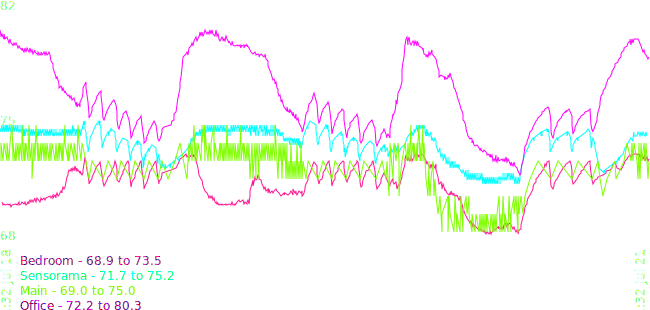
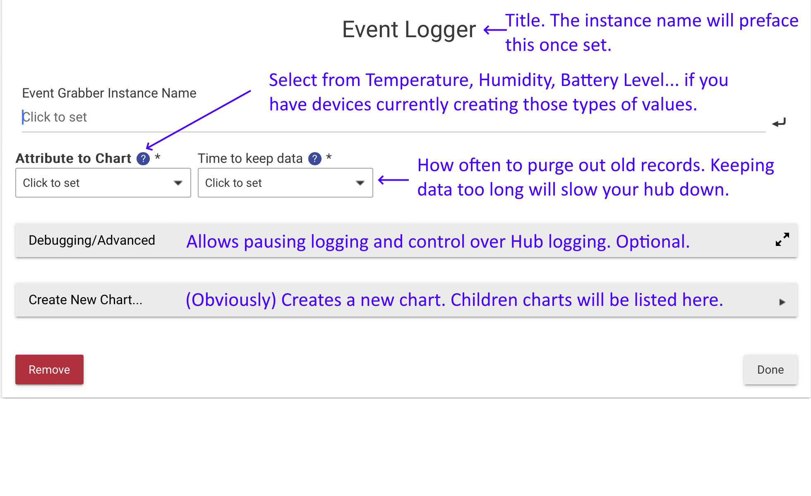
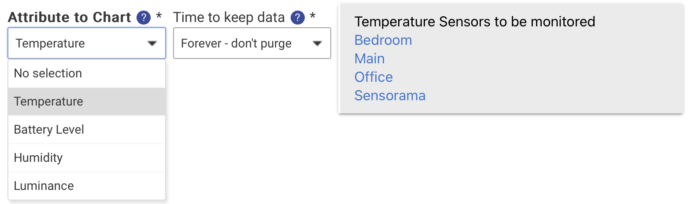
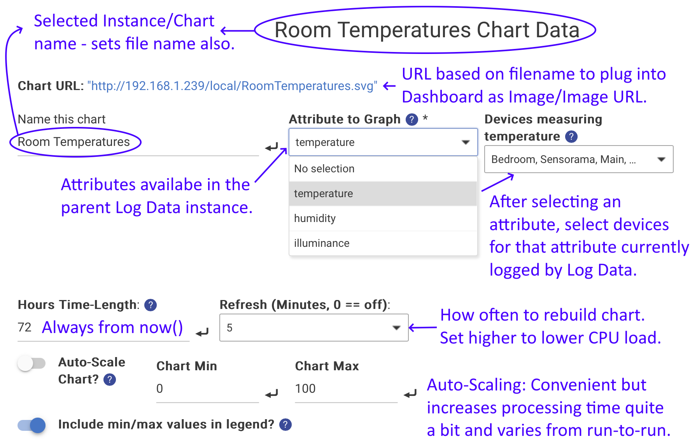
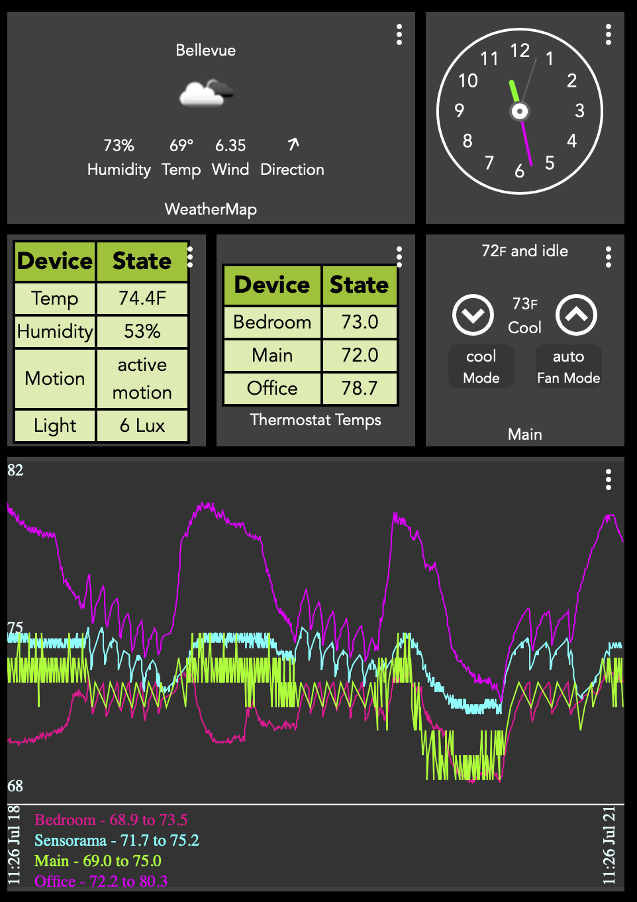

# Log/Chart Data for Hubitat Elevation
Log/Chart Data does on-device charting on the Hubitat home automation system.
No external connection is need.

# Installation
## Adding the App Code
As with other ["Community Apps"](https://community.hubitat.com/c/comappsanddrivers/72), the code for Log/Chart Data must be *imported* into your HE. Do this by expanding "Developer tools" on your Hub's U.I., selecting "Apps Code" and either importing or copy-and-pasting both:
- log-data.groovy
- chart-data.groovy

from this repository.
## Installing the Apps
This is exactly the same as other Hubitat "Community" apps; on the Apps tab, at the far upper right, select "+ Add User App". *Only* **Log Data** is available; **Chart Data** is a child app to **Log Data** and is added only from inside **Log Data** once **Log Data** is installed.

### Log Data Configuration

Selecting an attribute will allow selection of the devices supporting that attribute:

(Only certain numeric-value attributes are currently supported.)
**Not just for charting!** The output of **Log Data** is *JSON* files accessible through the HE's "File Manager." These can be used in other programs, such as Excel. Charting is entirely optional.
### Chart Data Configuration
If there are no "Attribute to Chart" choices, double-check that the parent **Log Data** app both has attributes and devices selected *and* has been installed. You may have to select "Done" on that page and re-enter it to be able to select **Chart Data** targets.

The chart size options should be self-explanatory; you'll want to align these with the tile selections in your dashboard if displaying a chart in the dashboard.
### Chart Color Selection
This is simpler than it seems, *as long as you understand the sequence*. 
Basically:
- Colors are always displayed as hex.
- You can copy-and-paste the "map" into the "Load Colors" field, *even using color names*.
- The drop-down allows you to select *which* color to set, and enter/tweak using the color-picker. 

The field options are:

- Series[1-6] - Data series. Only six devices are supported per chart mostly because it would be too cluttered otherwise.
- Axis - Color for the *lines* for the vertical and horizontal axis
- Labels - Color for the min/max chart value (vertical) and time value (horizontal) on the chart.
- Title - Color for the banner for the chart name. In the image below, "Room Temperatures". *The banner is optional*; when selected, an option to skip it appears.
- Background - Color for the chart background. *This can be transparent*, which is the default. When selected, a switch for that appears.
# Adding the Chart to the Dashboard
Charts must be *manually* added to the Dashboard. 
1. Create a new Tile, select type "Image"
2. For *Image URL*, copy the value from the "Chart URL" field on the Chart Preferences page.
3. Select an appropriate height and width tile-count.

# Notes
- When you select a device and attribute in *Log Data*, if there is no current data for that device in File Manager, it will load past events and extract data from those.
- *Because* Hubitat does not save a *long* list of events, the initial charts are not very impressive. Keep that in mind!
- In the *Log Data* JSON files, there are three fields: time, val and dateStr. dateStr is only present to make it easier for humans to understand. 
- You can have multiple charts of the same data. Just create additional child instances of **Log Data**.
# Trouble-Shooting
##Data Not Saving
1. Verify the subscription is there. Check on the device page.
2. Look in the device event history. 
3. Is the device set to notify? Some device drivers have both a reporting interval - how often they report the change - and a change trigger. Often the change trigger defaults to 5 %REL or 5°F, which may hide actual changes.

##DO NOT CHANGE DEVICE NAME.
While best practice would be to use Device ID to track a device, that would throw off the data file anyhow. If you change device name, you will have to rename the device file in File Manager and re-subscribe in Preferences.
# Thanks and Credits
- Tool Tip code: SBurke,  https://community.hubitat.com/t/tooltips-for-app-input-switches/137414
- 
# License
Log/Chart Data is licensed under [Apache 2.0. ](https://en.wikipedia.org/wiki/Apache_License), which is *permissive*. 
